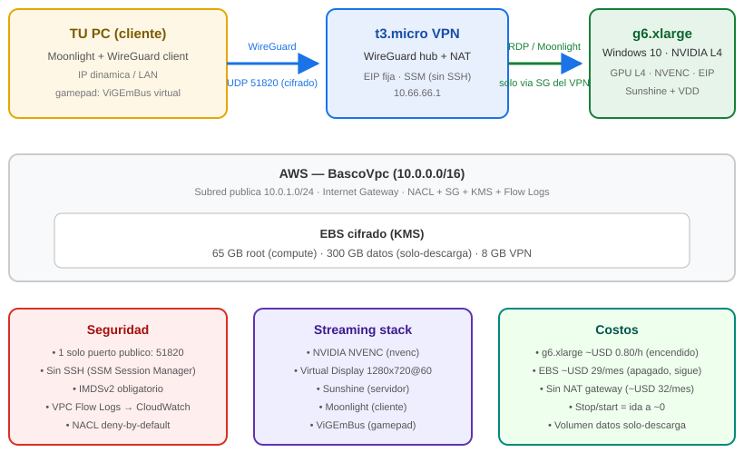

# NimbusStream — Headless GPU Cloud-Gaming Infrastructure on AWS

**NimbusStream** is an end-to-end infrastructure for cloud game streaming: a
Windows 10 gaming VM backed by an NVIDIA GPU in AWS (**g6.xlarge / L4**),
rendering headlessly on a virtual display and streamed to any computer on your
LAN at **720p/60 FPS** through a fully encrypted **WireGuard** tunnel.

The project is a personal cloud-gaming infrastructure exercise: a Windows 10
gaming VM with a virtual GPU rendering headlessly, a lightweight VPN as the only
inbound access point, **no RDP/SSH exposed to the internet**, and a server that
can be stopped/restarted to keep costs near zero when unused.



## Highlights

- **Custom multi-AZ VPC**: fully self-built network (10.0.0.0/16) with 3
  subnets across 2 availability zones, Internet Gateway, public route tables,
  and least-privilege security groups isolating the gaming tier from the
  WireGuard VPN tier.
- **On-device LLM stack**: **Ollama** serving **Llama** models on the GPU
  instance, reachable only through the VPN for private inference.
- **GPU in the cloud, two tiers**:
  - `g6.xlarge` (NVIDIA **L4**, 24 GB) — flagship, sustained FPS on modern
    titles at 720p@60.
  - `g4dn.xlarge` (NVIDIA **T4**, 16 GB) — cheaper alternative; same tooling,
    you just swap `gaming_instance_type`.
- **Headless rendering**: a **Virtual Display Driver (IDD/UMDF)** simulates a
  single 1280x720 monitor. No physical display, no extra FPS cost from phantom
  monitors.
- **Low-latency streaming**: **Moonlight → Sunshine** (open-source GameStream)
  over LAN-optimized bandwidth, tunable bitrate.
- **Encrypted transport**: **WireGuard** (Curve25519) on a `t3.micro` hub;
  keypair generated locally, never transmitted.
- **Hardened by default**: IMDSv2 required, EBS encrypted with a customer KMS
  key, VPC Flow Logs to CloudWatch, restrictive NACL, RDP allowed only from the
  VPN security group, SSM Session Manager for operations (no SSH).
- **Gamepad support**: **ViGEmBus** virtual controller so clients play with any
  gamepad, no hardware required on the server.
- **Zero-cost idle**: stop the instances when not playing; Elastic IPs remain
  free while associated.

## Repository layout

```
.
├── main.tf                 # EC2, VPN, security, networking (EWG)
├── variables.tf            # all tunables; secrets flagged "sensitive"
├── outputs.tf              # connection strings, command helpers
├── terraform.tfvars.example# copy to terraform.tfvars and fill in
└── docs/
    ├── SETUP.md            # step-by-step from scratch to first stream
    ├── COSTS.md            # on-demand pricing breakdown & savings tactics
    └── CV.md               # résumé-ready project summary (EN/ES)
```

## Quick start

```sh
# 1. Fill in your values (VPC, subnet, AMI, WireGuard keys, SSH keys)
cp terraform.tfvars.example terraform.tfvars
$EDITOR terraform.tfvars

# 2. Plan & apply
terraform init
terraform plan
terraform apply

# 3. Import the generated wg-client.conf into WireGuard on your PC,
#    then connect Moonlight to the gaming private IP.
```

Detailed steps, including post-boot Windows setup (VDD, Sunshine,
ViGEmBus), are in [docs/SETUP.md](docs/SETUP.md).

## Requirements

- Terraform (>= 1.5) — providers mirror/OpenTofu-compatible
- AWS account with a VPC and one public subnet
- A Windows 10/11 AMI (this repo was built against an imported AMI)
- WireGuard installed on your client machine

## Costs

The cost structure has two states that matter more than the hourly rate:
**running** and **stopped (idle)**.

| State | Component | Cost |
|---|---|---|
| **Running** | `g6.xlarge` GPU (Windows) | ~USD 0.80/h |
| | `g4dn.xlarge` GPU (Windows) | ~USD 0.53/h |
| | `t3.micro` VPN (Linux) | ~USD 0.0104/h |
| | EIPs (associated) | USD 0 |
| **Stopped** | EBS 65 GB root + 300 GB games + 8 GB VPN | ~USD 29/mo |
| | AMI + snapshot (65 GB) | ~USD 3.25–6.50/mo |

Key tactics: stop instances when idle (EIPs stay free), no NAT gateway
(~USD 32/mo saved), and a "download-only" 300 GB games volume (nothing is ever
uploaded → data-transfer cost ≈ 0). Full analysis in
[docs/COSTS.md](docs/COSTS.md).

## Security model

In brief — the system exposes **exactly one inbound port**:

| Surface | Exposure |
|---|---|
| WireGuard VPN (UDP 51820) | Public, `0.0.0.0/0` (client auth by key) |
| RDP (3389) | Only from the VPN security group |
| Moonlight (47984-48010) | Only from the VPN security group |
| SSH (22) | None — admin via SSM Session Manager |
| EC2 IMDS | v2-only, hop limit 1 |
| EBS | Encrypted at rest with KMS |

A full threat-model table lives in [docs/SETUP.md](docs/SETUP.md).

## Disclaimer

This is a personal learning/homelab project. It is not production-grade
(network ACL rules allow outbound ICMP broadly, key management is manual).
Use at your own risk and never commit real secrets — see `.gitignore`.